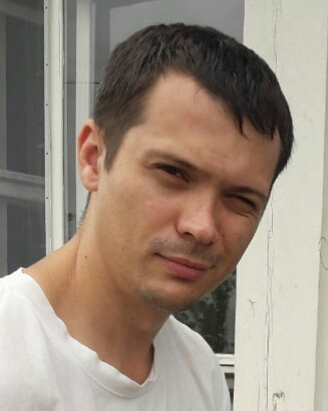

# Bachurin Dmitriy

## *Front-end Developer*
---
## Contact

E-mail: g.sektorian@gmail.com <br>
Discord: **Sektor**#7542<br>
City: BY, Brest

---
## Education
2004 - 2009<br>
**Brest State Technical University**<br>
Machine-Building Technologies

---
## Experience
2009 - 2021<br>
Design engineer of a machine-building enteprise

---
## Software skills
* MS Office
  * MS Word
  * MS Excel
* CAD
   * Ascon Kompas 3D
   * Autodesk Inventor
* IDE
   * IntelliJ IDEA
   * Visual Studio Code
---
## Training
* JavaRush
   * Java Syntax
* Code-basics
   * HTML
   * CSS
* Hexlet
   * Introduction to Git
* RS Schools
   * [JS/FE PRE-SCHOOL 2022 (JAVASCRIPT)](https://app.rs.school/certificate/7tww8mta)
---
## Code example
```java
public class Solution {
    public static void main(String[] args) throws Exception {
        //Работа программы: Вводить с клавиатуры числа и считать их сумму, пока пользователь не введет слово "сумма".
        BufferedReader reader = new BufferedReader(new InputStreamReader(System.in));
        double summ=0;
        while (true) {
            String s = reader.readLine();
            if (s.equals("сумма")) {
                System.out.println(summ);
                break;
            } else {
                double n = Double.parseDouble(s);
                summ = summ + n;
            }
        }
    }
}

```
## Projects
* [Audio player](https://sektorian.github.io/rss_projects/audio-player/)
* [Memory game](https://sektorian.github.io/rss_projects/memory-game/)
* [Movie-app](https://sektorian.github.io/rss_projects/movie-app/)
* [Portfolio](https://sektorian.github.io/rss_projects/portfolio-rise/)